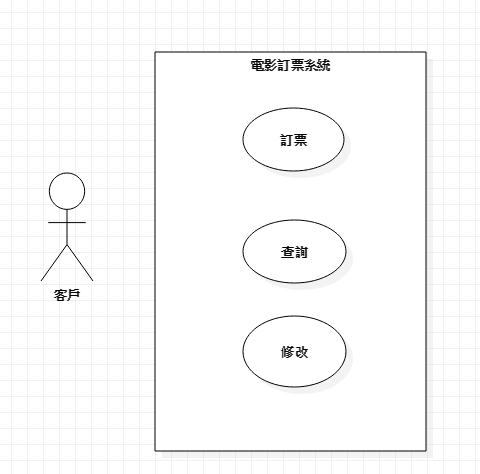

# 蕭博謙
## 學號 : 0624031
### 資管系三甲
#### 專題名稱 : 電影訂票系統
##### 小組成員:

* `0624031 蕭博謙`

###### `My First Assignment`	
```
0624031 蕭博謙
```
#### 需求清單

 可以查詢自己想要看的電影，和訂購電影票

#### 功能性需求
 * 註冊會員 
 * 電影資訊查詢
 * 電影訂票

#### 非功能性需求
 * 穩定的系統
 * 簡單明瞭的圖形化介面
#### 使用案例
 使用案例1 會員註冊
 1. 註冊會員
 2. 驗證信箱
 3. 會員登入

使用案例2 電影查詢
 1. 輸入電影名稱或撥放時段
 2. 顯示出查詢結果

 使用案例3 電影訂票
 1. 登入會員
 2. 進入想看的電影頁面
 3. 點擊加入購物車
 4. 選擇付款方式，例如信用卡或是超商付款

#### 使用案例圖


##### User Story
 * 使用者可以註冊會員，在輸入個人資料後，驗證完信箱就可以完成註冊作業，進行登入 
 * 使用者可以利用條件搜尋，例如電影名稱、播放時段等，可以瀏覽簡略的電影資訊，以及觀看電影預告
 * 使用者在登入後可以把要看的電影加入到購物車，選擇付款方式後完成訂票

##### 初步類別圖


##### 系統循序圖


[高科大](https://www.nkust.edu.tw/p/405-1000-5181,c2113.php)

<https://www.nkust.edu.tw/p/405-1000-5181,c2113.php>

|First|Second|Third|
|:------|:------:|------:|
|1|2|3|
|1|2|3|

:smile:
:cry:


[](https://www.youtube.com/watch?v=StTqXEQ2l-Y "Everything Is AWESOME")


