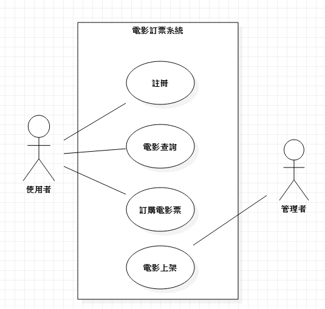
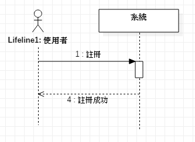
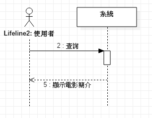
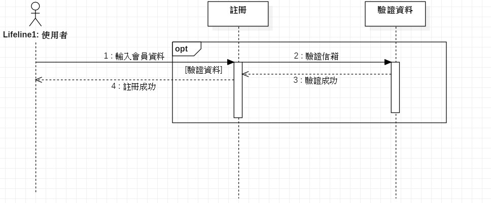
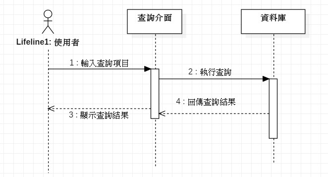
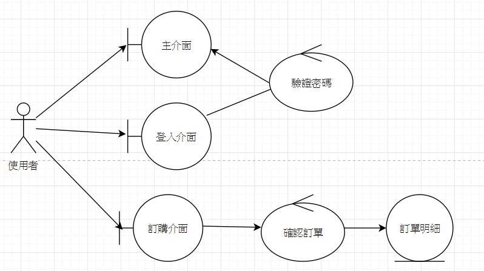

#  電影訂票系統

### 一、專題需求
 可以查詢自己想要看的電影，和訂購電影票
 
### 二、功能性需求

```
 * 註冊會員 
 * 登入會員
 * 電影資訊查詢
 * 電影訂票
``` 
### 三、非功能性需求

```
 * 穩定的系統
 * 簡單明瞭的圖形化介面
 * 每隔一段時間更新資訊
 * 系統的登入須具有密碼加密的機制
 ```
***
### 四、使用案例的重要性排序
```
1. 會員註冊
2. 電影查詢
3. 電影訂票
```
### 五、使用案例

##### 使用案例1 會員註冊
```
 1. 進入註冊介面
 2. 輸入會員資料
 3. 驗證信箱
```
##### 使用案例2 電影查詢
```
 1. 進入查詢介面
 2. 輸入電影名稱或撥放時段
 3. 顯示出查詢結果
```
 ##### 使用案例3 電影訂票
 ```
 1. 登入會員
 2. 進入想看的電影頁面
 3. 點擊加入購物車
 4. 選擇付款方式，例如信用卡或是超商付款
```
### 六、使用案例圖

***
### 七、User Story
 * 使用者可以註冊會員，在輸入個人資料後，驗證完信箱就可以完成註冊作業，進行登入 
 * 使用者可以利用條件搜尋，例如電影名稱、播放時段等，可以瀏覽簡略的電影資訊，以及觀看電影預告
 * 使用者在登入後可以把要看的電影加入到購物車，選擇付款方式後完成訂票
***
### 八、初步類別圖
##### 初步類別圖1 註冊會員


##### 初步類別圖2 電影查詢


##### 初步類別圖3 電影訂票


##### 類別圖

***
### 九、循序圖
#### 系統循序圖
##### 系統循序圖1 註冊會員


##### 系統循序圖2 電影查詢


##### 系統循序圖3 電影訂票

***
### 系統操作展開循序圖
##### 註冊展開循序圖

##### 查詢展開循序圖

##### 訂票展開循序圖

***
### 十、強韌圖
##### 註冊之強韌圖

##### 查詢之強韌圖

##### 訂票之強韌圖

##### 總和強韌圖

***
[高科大](https://www.nkust.edu.tw/p/405-1000-5181,c2113.php)

<https://www.nkust.edu.tw/p/405-1000-5181,c2113.php>

|First|Second|Third|
|:------|:------:|------:|
|1|2|3|
|1|2|3|

:smile:
:cry:


[](https://youtu.be/WCDY2gm0NH0 "GARNiDELiA-G.R.N.D")


